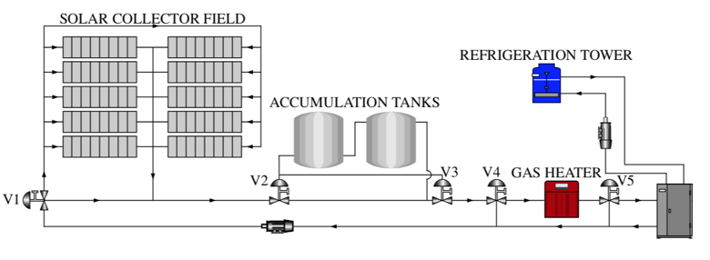

# An Adaptive LPV MPC Formulation for Industrial Non-linear Processes

## Abstract
This code presents the design of an adaptive *Linear Parameter Varying Model Predictive Control* (LPV-MPC) scheme for chemical industrial processes. The proposed LPV-MPC method resides in the operation of two consecutive *Quadratic Programing* (QP) problems: a *Moving Horizon Estimator* (MHE) and a regular *Model Predictive Controller* (MPC). The MPC includes a terminal set constraint to ensure recursive feasibility. The terminal set is determined offline through an *Linear Matrix Inequalities* (LMI) problem.

Simulation results, based on a Solar Thermal (ST) collector is given to illustrate the implementation and performance of such approach.

    

## Requirements
- At least an i5-3337U CPU@2.7 GHz (2 Cores) with 6 GB of RAM.
- [Matlab software](https://mathworks.com/) R2016b or greater

### Packages:
- [Yalmip](https://yalmip.github.io/)
- [Gurobi](https://www.gurobi.com/)
- [SeDuMi](http://sedumi.ie.lehigh.edu/)

## Paper info
Bernardi, Emanuel, Hugo Pipino, Carlos A. Cappelletti, and Eduardo J. Adam. "Adaptive Predictive Control for Industrial Processes." *In 2021 XIX Workshop on Information Processing and Control (RPIC)*, pp. 1-6. IEEE, 2021.

Send comments and questions to:

[Emanuel Bernardi](mailto:ebernardi@sanfrancisco.utn.edu.ar)
